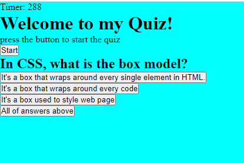

# codequiz

## Description 

This is an appication that allows users to take the quiz. Basically, it gives the user the possibility to take the quiz with multiple questions. Thus, the user picks the answer and submit it. Notice that the quiz is taken for a time well set. Moreover,This app will run in the browser.

Thus, the messages will be displaying to ask the user to start the quiz. Once the user starts taking the quiz, the time stars counting down. So every time the user clicks to pick the answer, he will move to the next question and so on.

The following image demonstrates the application functionality:

Below is the link to Deployment:
https://charles198618.github.io/passwordgenerator/

## OBJECTIVES

The motivation that pushed me to realize this project is because I wanted to solve a problem in society. I wanted to make the life of professor and students easier, by making this application. Therefore, the professor don't need to look at his clock everytime while students are taking quizzes or exams. So once the time is over, students will stop taking the quizz.

## Languages used

In order to get to this result, I have use HTML, CSS, and JavaScript, Dom, and Jquery. First of all, we can think about HTML as a body. it stands for Hypertext Markup Language. Basically, it is a language that we can use to create web pages. Thus every single on internet is written using HTML. Moreover, it includes elements on the pages, images on the pages, the orders of the appearance of elements and so on. Secondly, we have CSS that stands for Cascading Style Sheet. It is used to make our website beautiful. It's used to define the cell padding of table cells, the style, the thickness, and color of a table's border, and the padding around images or other objects. The third most important element to point out is JavaScript. It is a pragramming language like Java, PHP, Python, C++. It's considered as the brain in human body. It allows us to implement complex features on web pages, animated graphics, interactive maps and so on.  It's with JavaScript that we have succeded to make this project work.
Thus, DOM stands for Document Object Model. It's an application programming interface that for HTML and Script. It helps us to define the logical 
structure of documents. We can easily manipulate every tag of HTML in order such as grandparent, parent, children and so on.
We also have Jquery which is a library that contains many features such as HTML,DOM, AJAX, CSS manipulation and so on. Moreover, it helps us to accomplish many tasks and make them easier. Thus we can manipulate Dom easily. 

## Challenges met

There was many challenges during the realization of this project. The big obstacle was how to use JavaScript, DOM, and Jquery.